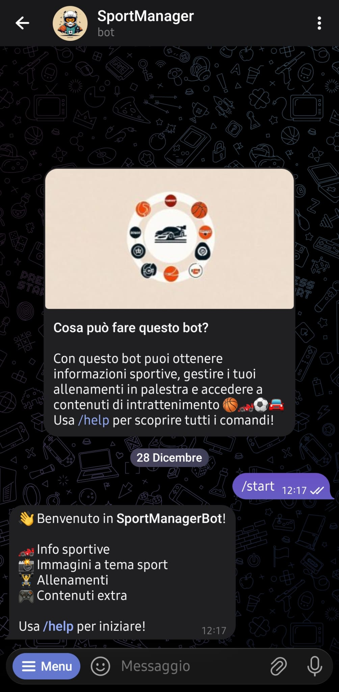
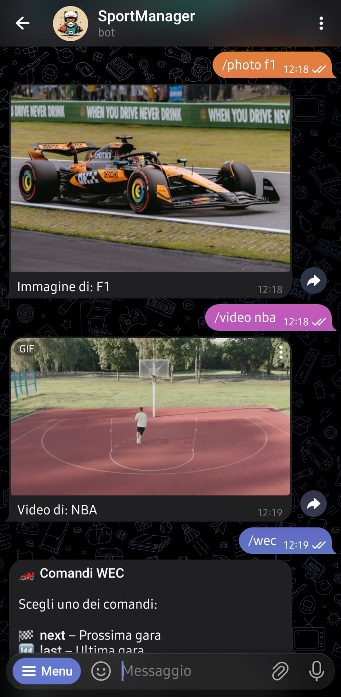
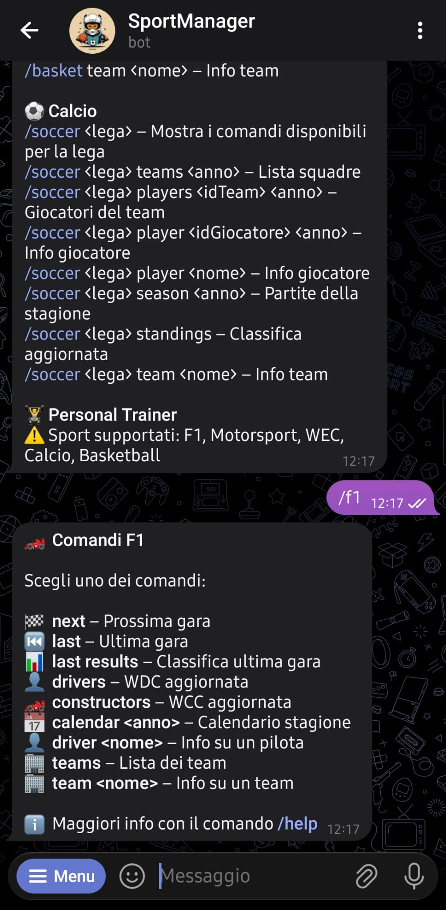
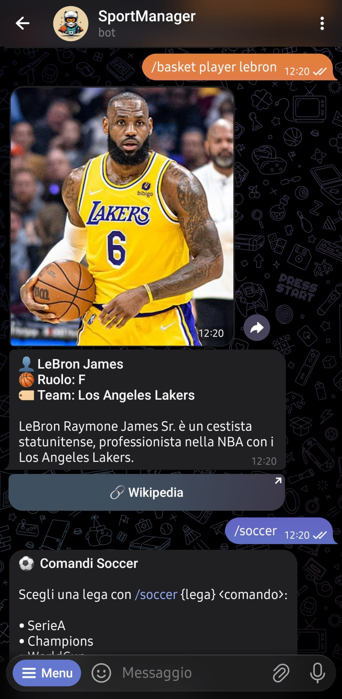
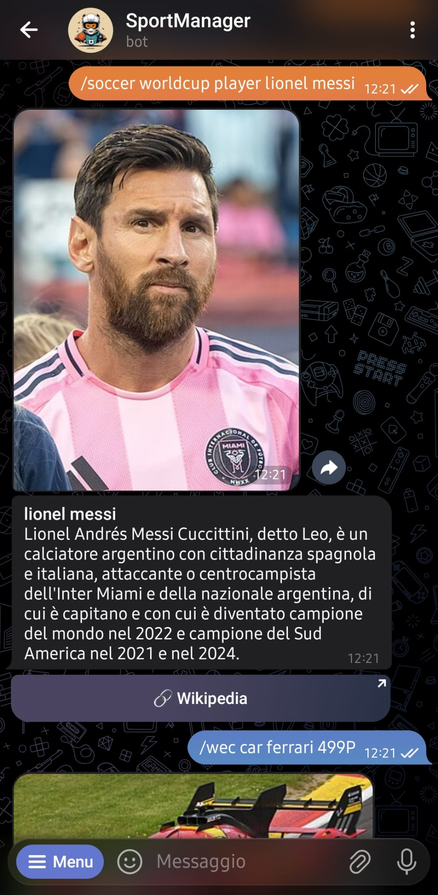
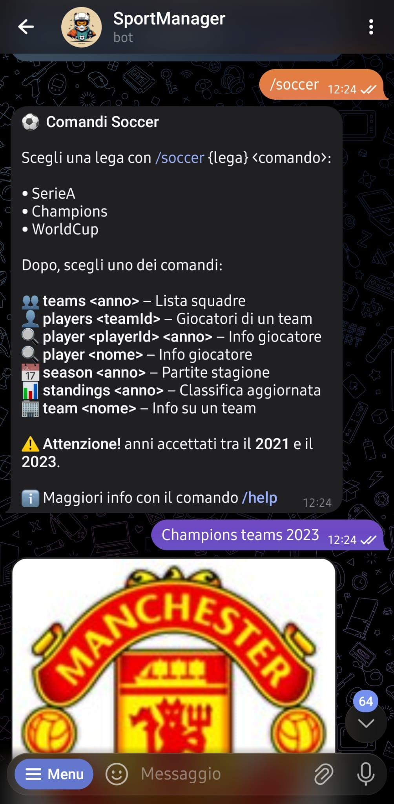
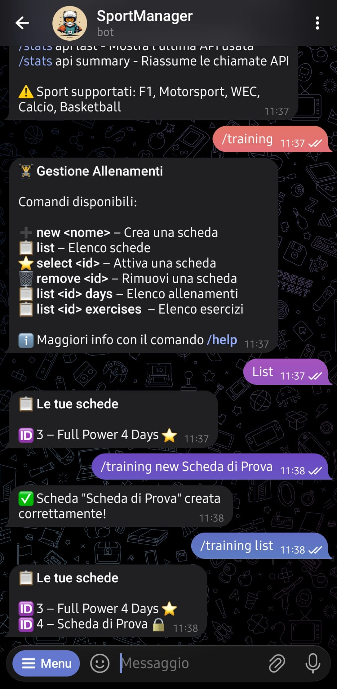
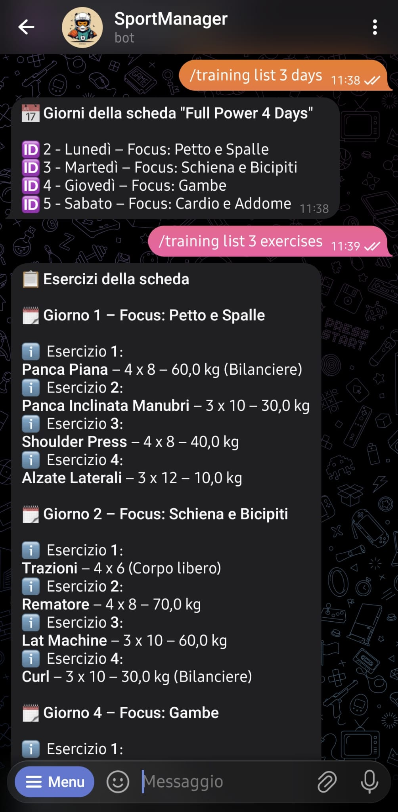
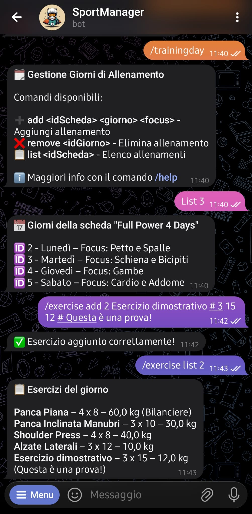
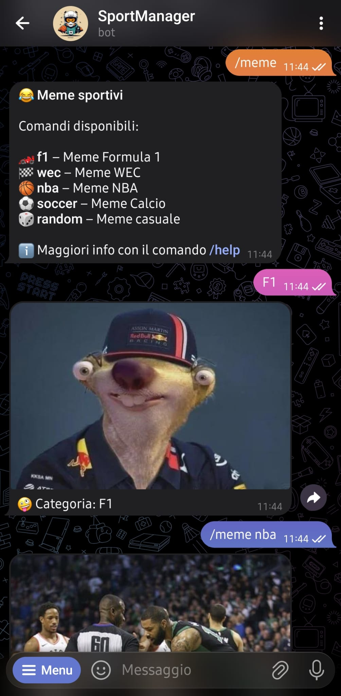

# 🏆 SportManagerBot

**SportManagerBot** è un bot Telegram sviluppato in **Java** da **Nicola Creazzo**, pensato per unire **informazione sportiva**, **intrattenimento** e **gestione degli allenamenti personali** in un’unica applicazione accessibile direttamente da Telegram.

Il bot interagisce con diverse **API REST pubbliche** per fornire dati aggiornati su vari sport come **Formula 1, WEC, Basket NBA e Calcio**, oltre a contenuti multimediali e informazioni enciclopediche.

---

## 📌 Idea del progetto

SportManagerBot nasce con l’obiettivo di permettere all’utente di:

- 📊 Ottenere **informazioni sportive aggiornate** tramite API REST
- 🖼️ Ricevere **immagini e video sportivi**
- 📚 Consultare **schede informative di team, piloti, atleti** tramite Wikipedia
- 🏋️ Gestire i propri **allenamenti in palestra** tramite database
- 🎉 Usufruire di funzionalità extra come:
    - meme sportivi
    - statistiche personalizzate

Il tutto senza uscire da Telegram.

---

## 🧩 Tecnologie utilizzate

- **Telegram Bot API**
- **HTTP Client Java**
- **Gson** (JSON parsing)
- **API REST via HTTPS**

---

## 🌐 API utilizzate

Il bot utilizza esclusivamente **API REST pubbliche**:

| API                       | Utilizzo                                 | Documentazione                                                 |
|---------------------------|------------------------------------------|----------------------------------------------------------------|
| Ergast API (jolpi/ergast) | Formula 1 (gare, piloti, costruttori)    | https://github.com/jolpica/jolpica-f1/blob/main/docs/README.md |
| TheSportsDB               | Motorsport, WEC, info team               | https://www.thesportsdb.com/api.php                            |
| Ball Don't Lie            | Basket NBA (giocatori, squadre, partite) | https://www.balldontlie.io                                     |
| API-Football              | Calcio (Serie A, Champions, Mondiali)    | https://www.api-football.com/documentation-v3                  |
| Pexels API                | Foto e video sportivi                    | https://www.pexels.com/api/                                    |
| Wikipedia REST API        | Descrizioni, immagini, loghi             | https://www.mediawiki.org/wiki/REST_API                        |

---

## ⚙️ Setup del progetto

### Clonazione repository
```bash
git clone https://github.com/tuo-username/SportManagerBot.git
cd SportManagerBot
```

### Configurazione file ``config.properties``
Copia il file di esempio:
```bash
cp example.properties config.properties
```
Apri il file e inserisci le tue chiavi API!
```properties
BOT_TOKEN = YOUR:BOT:TOKEN
PEXELS_API_KEY = YOUR:API:KEY
THESPORTSDB_API_KEY = YOUR:API:KEY
BALLDONTLIE_API_KEY = YOUR:API:KEY
APIFOOTBALL_API_KEY = YOUR:API:KEY
```

### Dipendenze e requisiti

- **Java JDK 21**
- **Apache Maven**
- Connessione HTTPS abilitata

Le principali librerie utilizzate dal progetto sono:

- **Telegram Bots API**
    - `telegrambots-longpolling`
    - `telegrambots-client`

- **Gson**
    - `com.google.code.gson:gson`

- **Apache Commons Configuration**
    - `commons-configuration2`

- **Apache Commons BeanUtils**
    - `commons-beanutils`

Estratto di ``POM.xml``:
```xml
<properties>
    <maven.compiler.source>21</maven.compiler.source>
    <maven.compiler.target>21</maven.compiler.target>
    <project.build.sourceEncoding>UTF-8</project.build.sourceEncoding>
</properties>

<dependencies>
    <dependency>
        <groupId>com.google.code.gson</groupId>
        <artifactId>gson</artifactId>
        <version>2.13.1</version>
    </dependency>

    <dependency>
        <groupId>org.telegram</groupId>
        <artifactId>telegrambots-longpolling</artifactId>
        <version>9.2.0</version>
    </dependency>

    <dependency>
        <groupId>org.telegram</groupId>
        <artifactId>telegrambots-client</artifactId>
        <version>9.2.0</version>
    </dependency>

    <dependency>
        <groupId>org.apache.commons</groupId>
        <artifactId>commons-configuration2</artifactId>
        <version>2.12.0</version>
    </dependency>

    <dependency>
        <groupId>commons-beanutils</groupId>
        <artifactId>commons-beanutils</artifactId>
        <version>1.9.4</version>
    </dependency>
</dependencies>
```

---

## 🤖 Guida all’utilizzo

### Comandi base
```
/start – Avvia il bot
/help – Mostra il messaggio di aiuto
```

### Foto e Video
```
/photo <sport> – Ricevi un’immagine sportiva
/video <sport> – Ricevi un video sportivo
```

### Formula 1
```
/f1 next – Prossima gara
/f1 last – Ultima gara
/f1 last results – Classifica ultima gara
/f1 drivers – WDC aggiornata
/f1 constructors – WCC aggiornata
/f1 calendar <anno> – Calendario stagione
/f1 driver <nome> – Info pilota
/f1 teams – Lista di alcuni team storici
/f1 team <nome> – Info team
```

### FIA WEC
```
/wec next – Prossima gara
/wec last – Ultima gara
/wec seasons <anno> – Stagione dell'anno scelto
/wec car <team> <modello> – Info sul modello scelto
```

### Basket (NBA)
```
/basket players – Lista giocatori (prima pagina)
/basket player <nome> – Cerca un giocatore
/basket teams – Lista squadre NBA
/basket games season <anno> – Partite per stagione
/basket games team <id> <anno> – Partite per team
/basket team <nome> – Info team
```

### Calcio (Champions League, Serie A, World Cup)
```
/soccer <lega> – Mostra i comandi disponibili
/soccer <lega> teams <anno> – Lista squadre
/soccer <lega> players <idTeam> <anno> – Giocatori del team
/soccer <lega> player <idGiocatore> <anno> – Info giocatore
/soccer <lega> player <nome> – Info giocatore
/soccer <lega> season <anno> – Partite della stagione
/soccer <lega> standings – Classifica aggiornata
/soccer <lega> team <nome> – Info team
```

### Meme sportivi
```
/meme f1 – Meme Formula 1
/meme wec – Meme WEC
/meme nba – Meme NBA
/meme soccer – Meme Calcio
/meme random – Meme casuale
```

### Personal Trainer
```
/training new <nome> – Crea nuova scheda
/training list – Elenco schede
/training select <id> – Attiva una scheda
/training remove <id> – Rimuovi una scheda
/training list <id> days – Elenco giorni di allenamento della scheda
/training list <id> exercises – Elenco esercizi della scheda
```

### Giorni di allenamento
```
/trainingday add <id scheda> <nome giorno> – Aggiungi un giorno alla scheda
/trainingday remove <id giorno> – Rimuovi un giorno dalla scheda
/trainingday list <id scheda> – Elenco giorni di allenamento della scheda
```

### Esercizi
```
/exercise add <id giorno> <nome esercizio> # <sets> <reps> <peso> # [note] – Aggiungi un esercizio
/exercise remove <id esercizio> – Rimuovi un esercizio
/exercise list <id giorno> – Elenco esercizi del giorno
```

### Allenamenti
```
/workout start <id giorno> – Inizia sessione di allenamento
/workout complete <id sessione> – Completa sessione di allenamento
/workout list – Elenco sessioni di allenamento registrate
```

### Personal Trainer
```
/stats workout done – Conteggio totale delle sessioni completate
/stats workout last – Mostra l'ultima sessione completata
/stats api top – Mostra l'API più utilizzata
/stats api last – Mostra l'ultima API usata
/stats api summary – Riassume le chiamate API
```

---

## 🗣️ Esempi di conversazione











---

## 🗄️ Struttura del Database  ``SportManager.db``
Il database gestisce:
- utenti Telegram
- schede di allenamento personalizzate
- giorni di allenamento
- esercizi definiti liberamente dall’utente
- sessioni di allenamento (log)
- richieste API

### ``users``
Memorizza gli utenti che interagiscono con il bot tramite Telegram.
- id
- telegram_id (univoco)
- username
- first_name
- created_at

### ``training_plans``
Rappresenta una scheda di allenamento personalizzata per ogni utente.
- id
- user_id
- name
- is_active
- created_at

### ``training_days``
Definisce i giorni della settimana associati a una scheda di allenamento.
- id
- plan_id
- day_of_week (1 = Lunedì, 7 = Domenica)
- focus

### ``user_exercises``
Esercizi definiti liberamente dall’utente per uno specifico giorno.
- id 
- training_day_id 
- name 
- sets 
- reps 
- weight 
- notes

### ``workout_sessions``
Registra le esecuzioni reali degli allenamenti, consentendo la generazione di statistiche.
- id
- training_day_id
- execution_date
- completed

### ``api_requests``
Registra le richieste effettuate alle API REST per analizzare le preferenze degli utenti e generare statistiche globali.
- id
- user_id
- sport
- entity
- endpoint
- requested_at

### ``memes``
Contiene meme caricati manualmente per un accesso randomico su richiesta.
- id
- sport
- img_url
- created_at

### Struttura e relazioni:
```
users
 ├── training_plans 
 │    └── training_days 
 │         ├── user_exercises 
 │         └── workout_sessions 
 └── api_requests
 
 memes
```

## 📊 Database Cool Queries & Statistics
Il progetto include diverse query SQL e metodi di aggregazione già implementati all’interno della classe `DBManager`, utilizzate per ottenere statistiche e informazioni utili sull’attività degli utenti, gli allenamenti e l’utilizzo delle API.

### 👤 User Statistics
**Recupero utente tramite Telegram ID**
```sql
SELECT * FROM users WHERE telegram_id = ?
```

### 🏋️ Training Plans & Workouts
**Conteggio allenamenti completati nel piano attivo**
```sql
SELECT COUNT(ws.id)
FROM workout_sessions ws
JOIN training_days td ON ws.training_day_id = td.id
JOIN training_plans tp ON td.plan_id = tp.id
WHERE tp.user_id = ?
AND tp.is_active = 1
AND ws.completed = 1
```

**Ultima sessione di allenamento eseguita**
```sql
SELECT ws.*
FROM workout_sessions ws
JOIN training_days td ON ws.training_day_id = td.id
JOIN training_plans tp ON td.plan_id = tp.id
WHERE tp.user_id = ?
AND tp.is_active = 1
ORDER BY ws.execution_date DESC
LIMIT 1
```

### 🌐 API Usage Statistics
**Ultima richiesta API effettuata da un utente**
```sql
SELECT * FROM api_requests
WHERE user_id = ?
ORDER BY requested_at DESC
LIMIT 1
```

**API più utilizzata da un utente**
```sql
SELECT sport, entity, endpoint, COUNT(*) AS total
FROM api_requests
WHERE user_id = ?
GROUP BY sport, entity, endpoint
ORDER BY total DESC
LIMIT 1
```

### 😂 Sport Memes
**Meme casuale per sport**
```sql
SELECT * FROM sport_memes
WHERE category = ?
ORDER BY RANDOM()
LIMIT 1
```